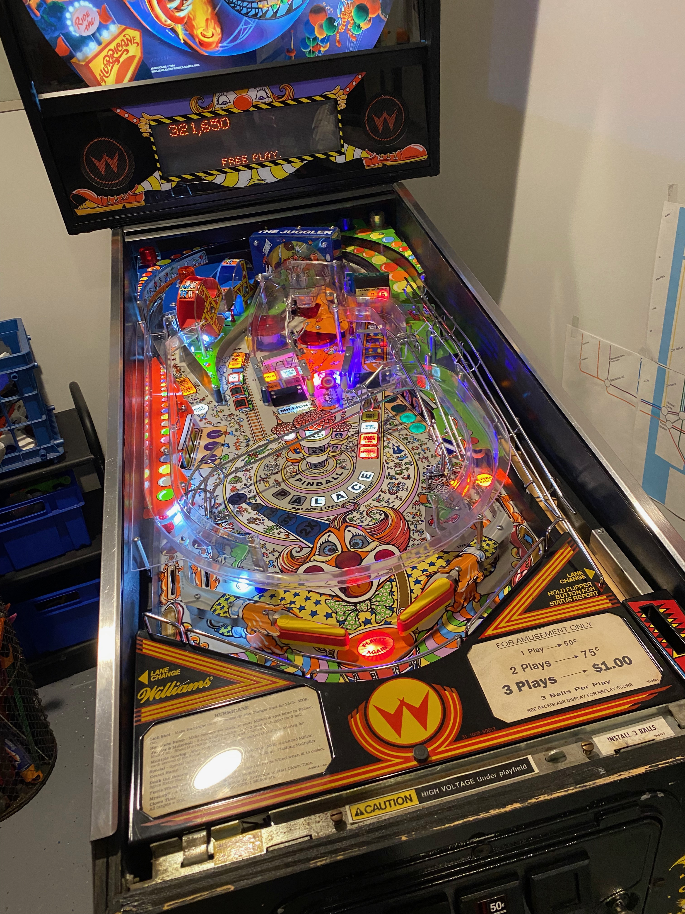

# HurricanePinballRamp

Lower ramp manufactured for 1991 Williams Hurricane pinball machine

This was designed to replace a clear plastic ramp for my pinball machine.  First I bought clear filament for my 3D printer and made one in pieces and superglued them together.  It operated correctly but was not completely clear, so obstructed view of the ball during play.  

I learned that the right way to do this is vacuum forming, and started to call around to manufacturers to see if anybody would work with me.  They all hung up on me, except for Andrea at https://www.metlflo.com/.  These guys did an exceptional job creating a mold and vacuum forming 20 ramps for me, which I then sold on https://www.etsy.com/ for $300 a piece.  Many accused me of highway robbery, but the price was calculated so that I could break even on the project.

And now I am open-sourcing the whole thing.  So I guess I get to go to heaven after all.  For you Hurricane owners who are less DIY inclined, you can go ahead and contact MetLFlo directly.  They still have the mold, and I'm sure they'll make you one if you pay them. For those of you even less DIY inclined, I still have one extra ramp left.  But I'm not selling that for less than $500.

So much for heaven.

The STEP file that was used to create the mold is [RampDv4.step](RampDv4.step). To watch the movie created by Fusion 360, click on [RampEv2.mp4](RampEv2.mp4).  If you are planning on 3D printing this, you can try [RampD.3mf](RampD.3mf), but unless you have an enormous device you'll need to cut it up.  If you just want the overall dimensions, please reference [RampDDrawingv1.pdf](RampDDrawingv1.pdf).
 

